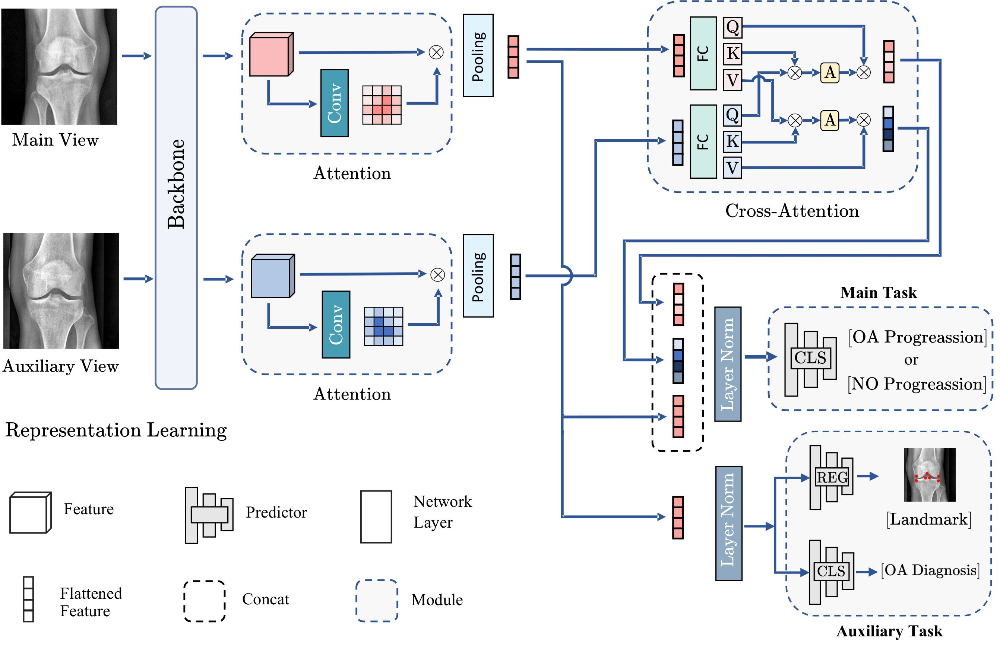
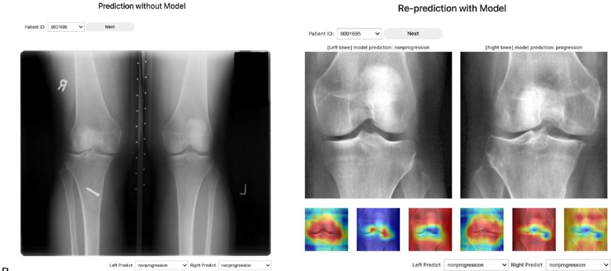
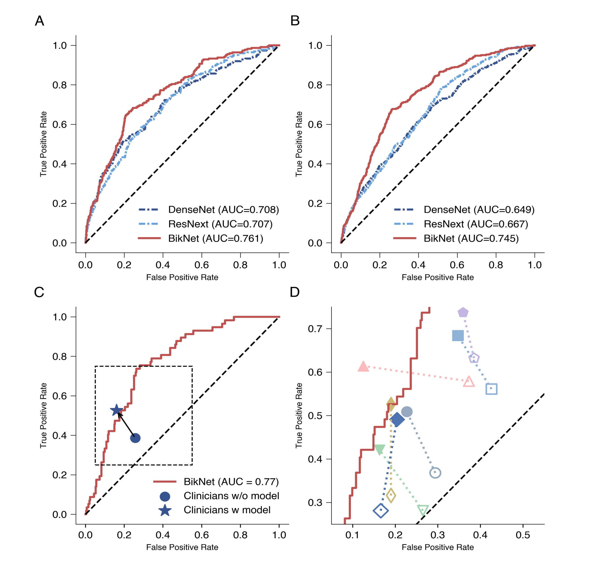

## Bilateral-Knee-Network

This repo is maintained by Rui Yin$^1$ and [Hao Chen](chqwer2.github.io)$^2$.

*1 Department of Sports Medicine and Joint Surgery, Nanjing Medical University affiliated Nanjing Hospital, Nanjing, China*

*2  [School of Computer Science](https://www.birmingham.ac.uk/schools/computer-science/index.aspx), University of Birmingham, Birmingham, UK*


If you have any question, feel free to leave it in issues or email hao.chen.cs@gmail.com

_______
- **_News (2023-4-15)_**: We release the [**Demo**](https://www.kaggle.com/calvchen/bilateral-knee-network-demo) for [BikNet](https://github.com/chqwer2/chqwer2.github.io/blob/main/_papers/biknet/biknet_submission.pdf). 

- **_News (2023-4-15)_**: We release the training codes of [BikNet](https://github.com/chqwer2/chqwer2.github.io/blob/main/_papers/biknet/biknet_submission.pdf) for radiographic osteoarthritis progression prediction. 

- **_News (2023-4-13)_**: The paper [Expanding from Unilateral to Bilateral: a robust deep learning-based approach for radiographic osteoarthritis progression](https://github.com/chqwer2/chqwer2.github.io/blob/main/_papers/biknet/biknet_submission.pdf) or abbreviated as **BikNet** was submitted to *Arthritis & Rheumatology 2023*

  

### Network architectures

- [BikNet](https://github.com/chqwer2/chqwer2.github.io/blob/main/_papers/biknet/biknet_submission.pdf)



##### Reproduce

Run the training

```
python main.py --opt options/training/Bilateral.json
```

[Test Demo](https://www.kaggle.com/calvchen/bilateral-knee-network-demo) is also available in Kaggle. 

##### Results


